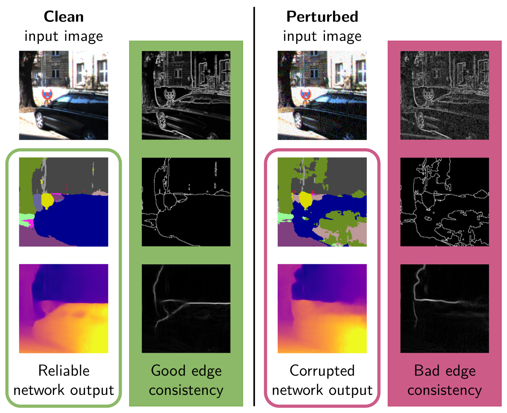
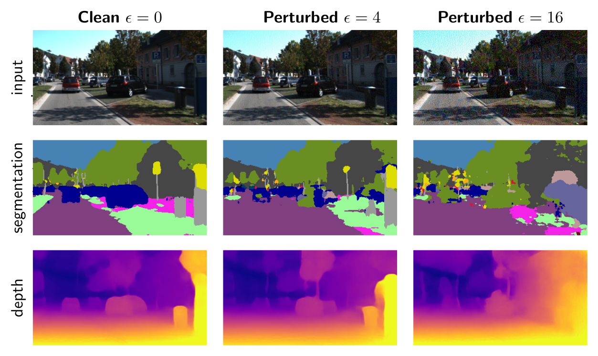

# Detecting Adversarial Perturbations in Multi-task Perception

[Marvin Klingner](https://www.tu-braunschweig.de/en/ifn/institute/team/sv/klingner), 
Varun Ravi Kumar, 
Senthil Yogamani, 
[Andreas Bär](https://www.tu-braunschweig.de/en/ifn/institute/team/sv/baer),
and [Tim Fingscheidt](https://www.tu-braunschweig.de/en/ifn/institute/team/sv/fingscheidt) – IROS 2022

[Link to paper](https://arxiv.org/abs/2203.01177) 

[Link to short video](https://youtu.be/KKa6gOyWmH4)

<p align="center">
  
</p>

## Idea Behind the Method

Perturbations on the input image during inference, in particular adversarial perturbations, can have a strong impact on the performance of a deep neural network.
In our paper, we propose to detect adversarial perturbations using a multi-task deep neural network.
By measuring the pair-wise edge consistencies between RGB image input and depth and segmentation outputs such perturbations can be detected by their induced low edge consistencies.

## Citation

If you find our work useful or interesting, please consider citing [our paper](https://arxiv.org/abs/2203.01177):

```
@inproceedings{klingner2020selfsupervised,
 title   = {{Detecting Adversarial Perturbations in Multi-task Perception}},
 author  = {Marvin Klingner and
            Varun Ravi Kumar and
            Senthil Yogamani and
            Andreas B{\"a}r and
            Tim Fingscheidt
           },
 booktitle = {{IEEE/RSJ International Conference on Intelligent Robots and Systems (IROS)}},
 year = {2022}
}
```

## Our Pre-trained Model

We provide our pre-trained model with the following results achieved on the KITTI 2015 dataset:

|        Model       |  mIoU |  Abs Rel | Sq Rel |  RMSE | RMSE log | δ < 1.25 | δ < 1.25^2 | δ < 1.25^3 |
|:------------------:|:-----:|:--------:|:------:|:-----:|:--------:|----------|------------|------------|
| [Trained model](https://drive.google.com/file/d/15ukbe6c3h3VG80DSn3nUxvXB4rFtCk3U/view?usp=sharing) | 51.6 | 0.101  | 1.030  | 6.137 | 0.162  | 0.894  | 0.972  | 0.990 |

Please download the zip file and extract it in the code's root directory.

### Inference Preview:
<p align="center">
  
</p>

## Prerequisites and Requirements
We recommend to use Anaconda. An `environment.yml` file is provided.
We use PyTorch 1.8.2 with CUDA 11.1.
To start working with our code, do the following steps:

1. Download the Cityscapes dataset: *https://www.cityscapes-dataset.com/* and put it in a folder "Dataset"
2. Download KITTI dataset: *http://www.cvlibs.net/datasets/kitti/* and place it in the same dataset folder. To ensure that you have the same folder structure as we have, you can directly use the script ``dataloader\data_preprocessing\download_kitti.py``.
3. If you want to evaluate on the KITTI 2015 stereo dataset, also download it from *http://www.cvlibs.net/datasets/kitti/* and apply the ``dataloader\data_preprocessing\kitti_2015_generate_depth.py`` to generate the depth maps.
4. Prepare the dataset folder:
    - export an environment variable to the root directory of all datasets: ```export IFN_DIR_DATASET=/path/to/folder/Dataset```
    - Place the <a href="https://drive.google.com/drive/folders/1Ky66UBRtMCBgu2qp6Nchd9psZkDgeuyT">json files</a> in your ```cityscapes``` folder. Please take care, that the folder is spelled exactly as given here: ```"cityscapes"```.
    - Place the <a href="https://drive.google.com/drive/folders/1Qmb31xqcLAR9DgicN9Lo5GNxXujuyK5N">json files</a> in your ```kitti``` folder. Please take care, that the folder is spelled exactly as given here: ```"kitti"```.
    - Place the <a href="https://drive.google.com/drive/folders/1sLJQM3VZWFG44lHbPaTnr6EVu3d3ksMX">json files</a> in your ```kitti_zhou_split``` folder. Please take care, that the folder is spelled exactly as given here: ```"kitti_zhou_split"```.
    - Place the <a href="https://drive.google.com/drive/folders/1CkqRlKdFyCTi5nEvSUjfTL3wHl_9qPjm">json files</a> in your ```kitti_kitti_split``` folder. Please take care, that the folder is spelled exactly as given here: ```"kitti_kitti_split"```.
    - Place the <a href="https://drive.google.com/drive/folders/1vpZGir2teKx1ZBALy5LQb9oXwSXQmWqx">json files</a> in your ```kitti_2015``` folder containing the KITTI 2015 Stereo dataset. Please take care, that the folder is spelled exactly as given here: ```"kitti_2015"```.

For further information please also refer to our dataloader: <a href="https://github.com/ifnspaml/IFN_Dataloader"> Dataloader Repository </a>

## Code Execution
For evaluation according to our method use `eval_joint.py`. 
Example scripts on how to use it to evaluate the model are provided in ``evaluate_attacks_cs.sh`` and ``evaluate_attacks_kitti.sh``

## License
This code is licensed under the <b>MIT-License</b> feel free to use it within the boundaries of this license.
